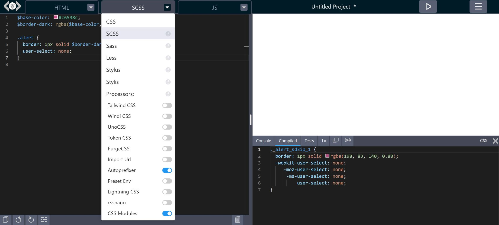

# CSS

import LiveCodes from '../../src/components/LiveCodes.tsx';

The [result page](./result.md) can be styled with CSS using various methods, including:

## Style Editor

Code added to [style editor](./projects.md#style-editor) is [compiled](#languages) and [processed](#css-processors), then added as CSS to the [result page](./result.md) `head` element.



### Languages

LiveCodes supports multiple languages that compile to CSS, including [SCSS](../languages/scss.md), [Sass](../languages/sass.md), [Less](../languages/less.md) and [Stylus](../languages/stylus.md). Code authored in any of these languages is compiled to CSS before being added to the [result page](./result.md).

The style language can be selected from the style editor menu. In embedded playgrounds, the language can be configured via the configuration object property [`style.language`](../configuration/configuration-object.md#style)

### CSS Processors

The (compiled) CSS code can be processed by one or more of the supported CSS processors. Examples of these include: [Autoprefixer](../languages/autoprefixer.md), [postcss-preset-env](../languages/postcssPresetEnv.md), [Lightning CSS](../languages/lightningcss.md), [CSS Modules](../languages/cssmodules.md), [cssnano](../languages/cssnano.md), ...etc.

Multiple CSS processors can be enabled at the same time. The code is processed in the order of processors placed in the style editor menu of the app.

Processors are enabled in the [standalone app](../getting-started.md#standalone-app) from the style editor menu, by switching on the toggles of the required processors.

In embedded playgrounds, processors are enabled via the [`processors`](../configuration/configuration-object.md#processors) property of the [configuration object](../configuration/configuration-object.md).

### Style Imports

[Bare modules](./module-resolution.md#bare-module-imports) used with `@import` rules are supposed to be npm modules. These are converted to [full URLs from CDN](./module-resolution.md#cdn-providers).

#### Example

This code:

```css
@import 'github-markdown-css/github-markdown.css';
```

becomes:

```css
@import 'https://unpkg.com/github-markdown-css/github-markdown.css';
```

Packages that specify a stylesheet as the main module can be imported like that:

```css
@import 'github-markdown-css';
```

demo:

<LiveCodes template="markdown" params={{activeEditor:'style', compiled:'open'}}></LiveCodes>

The content can be inlined in the compiled CSS by enabling the processor [postcss-import-url](../languages/postcssImportUrl.md).

### Compiled CSS

Compiled CSS (following compilation of style language, and all enabled processors) is added to the [result page](./result.md) `head` element.

The compiled code can be inspected in the [compiled code viewer](./compiled-code.md) in the [tools pane](./tools-pane.md).

### Auto-update

When [`autoupdate`](../configuration/configuration-object.md#autoupdate) is enabled (default), in contrast to [markup editor](./projects.md#markup-editor) and [script editor](./projects.md#script-editor), changes in style editor code does NOT trigger a full reload of the [result page](./result.md). The updated CSS code is sent to the page and applied without a reload.

The page can be force-reloaded by clicking the run button or using the keyboard shortcut: <kbd>Shift</kbd>&nbsp;+&nbsp;<kbd>Enter</kbd>.

## External Resources

External stylesheets can be added in [external resources](./external-resources.md) screen. These are added to the [result page](./result.md) before the compiled style editor code. This allows code in style editor to override CSS properties in external stylesheets.

External stylesheets can be added to embedded playgrounds using the [configuration object](../configuration/configuration-object.md) property [`stylesheets`](../configuration/configuration-object.md#stylesheets).

## CSS Presets

CSS presets like [Normalize.css](https://necolas.github.io/normalize.css/) and [Reset CSS](https://meyerweb.com/eric/tools/css/reset/) can be selected in [external resources](./external-resources.md#css-presets) screen.

## Stylesheets Imported in Script Editor

### External Stylesheets

CSS stylesheets imported in the script editor are added to the [result page](./result.md) `head` element. _The URL has to end with **`.css` extension**_.

For example, adding this in the script editor (JavaScript):

```js
import 'https://unpkg.com/github-markdown-css/github-markdown.css';
```

adds this to the page `head`:

```html
<link rel="stylesheet" href="https://unpkg.com/github-markdown-css/github-markdown.css" />
```

Currently, compiling imported stylesheets (e.g. SCSS) is not supported.

Similar to [imports in style editor](#style-imports), bare imports are converted to full URLs from CDN.

For example:

```js
import 'github-markdown-css/github-markdown.css';
```

becomes:

```html
<link rel="stylesheet" href="https://unpkg.com/github-markdown-css/github-markdown.css" />
```

### `./style.css`

Importing the URLs (`./style.css` or `./styles.css`) gets the style editor compiled/processed CSS **string** as the module's default export.

Example:

```js
import styles from './style.css';

console.log(styles); // => compiled CSS as string
```

## CSS Modules

CSS modules are supported and are [documented separately](../languages/cssmodules.md).

## CSS Frameworks

Multiple CSS frameworks are supported including [Tailwind CSS](../languages/tailwindcss.md), [UnoCSS](../languages/unocss.md) and [WindiCSS](../languages/windicss.md).

## Styles in Markup & Script

Of course, styles and stylesheets can still be added as usual in markup and script editors (via HTML elements and/or DOM).

## Related

- [Projects](./projects.md)
- [External resources](./external-resources.md)
- [Module resolution](./module-resolution.md)
