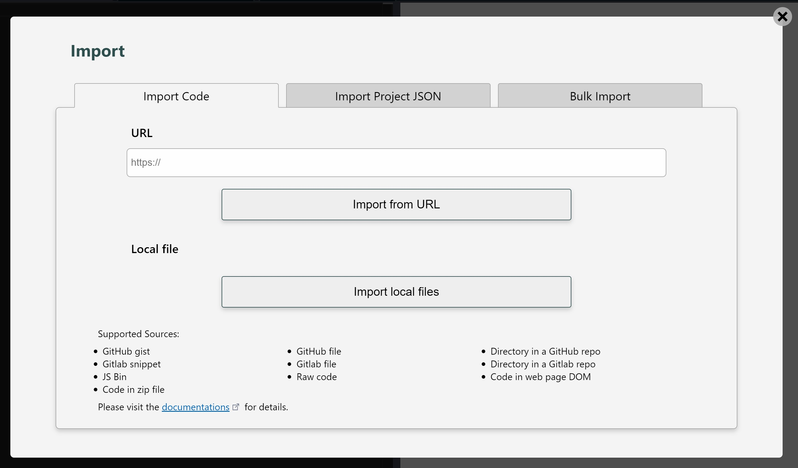

# Import

## Overview

LiveCodes supports importing code from a wide variety of sources.

The Import screen can be accessed from the app menu → Import.

import RunInLiveCodes from '../../src/components/RunInLiveCodes.tsx';

<RunInLiveCodes params={{screen: 'import'}} linkText="direct link" />



Alternatively, a URL of any of the sources can be imported on-load by adding it as a value to [query param](../configuration/query-params.md) key: `x`. This is easier using the [bookmarklet](../bookmarklet.md).

For [embedded playgrounds](./embeds.md), use the [SDK](../sdk/index.md) property [`EmbedOptions.import`](../sdk/js-ts.md#import).

## Examples

- GitHub File:

  URL: https://github.com/lodash/lodash/blob/master/isObject.js

  [Open in LiveCodes](https://livecodes.io/?x=https://github.com/lodash/lodash/blob/master/isObject.js)

- GitHub Directory:

  URL: https://github.com/bradtraversy/50projects50days/tree/master/expanding-cards

  [Open in LiveCodes](https://livecodes.io/?x=https://github.com/bradtraversy/50projects50days/tree/master/expanding-cards)

- GitHub Gist:

  URL: https://gist.github.com/f01deb828a42f363502fbae7964d48e9

  [Open in LiveCodes](https://livecodes.io/?x=https://gist.github.com/f01deb828a42f363502fbae7964d48e9)

- JS Bin:

  URL: https://jsbin.com/iwovaj/73/embed?html,js,output

  [Open in LiveCodes](https://livecodes.io/?x=https://jsbin.com/iwovaj/73/embed?html,js,output)

- Vue Playground:

  URL: [https://play.vuejs.org/#eNp9kUFKAzEUhq/yyKYKtUW6K9OCli4UUVFxlU2Z...](https://play.vuejs.org/#eNp9kUFKAzEUhq/yyKYKtUW6K9OCli4UUVFxlU2Zvk5TM0lIXsbCMGdw7QG8g+fxAl7Bl5RWF9Jd3v//7+cLrxUXzg2aiGIsilB65QgCUnRTaVTtrCdoweMKOlh5W0OPoz1ppCmtCQR1qGCS/JPejWpwZpcY4Ov94/vzDZ45eSpNMdzVciEPhLXTC0KeAIr1+bRtc0nXFUOesqqMiwTNWc1teiIF+1KwVQwP26IvKDDCSlWDTbCG6du0K0Vpa6c0+jtHihGlGEN2krfQ2r5eZ418xP5eL9dYvvyjb8I2aVLcewzoG5Ti4NHCV0g7e/54i1t+H0wmj5rTR8wHDFbHxLiLXUazZOw/uUx7lW+gTPUU5ltCE/afSqAp2eW8FHyX2ZGv/+KOBqO8J00nuh/8Wasi)

  [Open in LiveCodes](https://livecodes.io/?x=https%3A%2F%2Fplay.vuejs.org%2F%23eNp9kUFKAzEUhq%2FyyKYKtUW6K9OCli4UUVFxlU2Zvk5TM0lIXsbCMGdw7QG8g%2BfxAl7Bl5RWF9Jd3v%2F%2F7%2BcLrxUXzg2aiGIsilB65QgCUnRTaVTtrCdoweMKOlh5W0OPoz1ppCmtCQR1qGCS%2FJPejWpwZpcY4Ov94%2FvzDZ45eSpNMdzVciEPhLXTC0KeAIr1%2BbRtc0nXFUOesqqMiwTNWc1teiIF%2B1KwVQwP26IvKDDCSlWDTbCG6du0K0Vpa6c0%2BjtHihGlGEN2krfQ2r5eZ418xP5eL9dYvvyjb8I2aVLcewzoG5Ti4NHCV0g7e%2F54i1t%2BH0wmj5rTR8wHDFbHxLiLXUazZOw%2FuUx7lW%2BgTPUU5ltCE%2FafSqAp2eW8FHyX2ZGv%2F%2BKOBqO8J00nuh%2F8Wasi)

## Sources

Import is supported from any of the following:

- GitHub gist
- GitHub file
- Directory in a GitHub repo
- Gitlab snippet
- Gitlab file
- Directory in a Gitlab repo
- JS Bin
- [Shared projects](./share.md)
- Raw code
- Code in web page DOM
- Code in zip file
- Projects shared in official playgrounds of [TypeScript](https://www.typescriptlang.org/play), [Vue](https://play.vuejs.org/) and [Svelte](https://svelte.dev/repl)
- [Exported project JSON](./export.md) (single project and bulk import)

Import sources are identified by URL patterns (e.g. origin, pathname and extension).

## File Selection

For sources that provide multiple files (e.g. GitHub/GitLab directories, GitHub gists, GitLab snippets and zip files), a best guess is tried to load files in respective editors. Best results are when there are 3 files and each file is in a language (identified by file extension) that can be loaded to a different editor, for example:

- index.html, style.css, script.js
- default.pug, app.scss, main.ts

Markup files starting with `index.`, style files starting with `style.` and script files starting with `script.` are given higher priority. While Markup files starting with `readme.` are given lower priority.

Alternatively, languages and files can be specified using [query params](../configuration/query-params.md):  
`?x={url}&{language1}={file1}&{language2}={file2}&{language3}={file3}`

## Import Shared Projects

[Shared Projects](./share.md) can be imported using the value of the query param `x` generated by the Share screen. This starts with either:

- `code/`: for compressed base64-encoded project config
- `id/`: for short URLs recognized by shared project id.

Example:

https://livecodes.io/?x=id/bi9qszw86w3

## Import Code from DOM

If the source URL does not match one of the supported origins (GitHub, GitLab and JS Bin), the URL is fetched, its response text is parsed as [DOM](https://developer.mozilla.org/en-US/docs/Web/API/Document_Object_Model) and code is extracted from elements that match specific CSS selectors.  
(By default: `.livecodes [data-lang="{language}"]`)

:::info Example

```html
<code class="livecodes">
  <pre data-lang="html">This is identified as &lt;strong&gt;HTML&lt;/strong&gt; code</pre>
</code>
```

The HTML editor is prefilled with: `This is identified as <strong>HTML</strong> code`

Please note that the code should be html-encoded to avoid interference with the HTML of the page.

:::

Example:

https://livecodes.io/?x=https://live-codes.github.io/livecodes-examples/prefill-from-code-blocks.html

Alternatively, custom CSS selectors can be specified using [query params](../configuration/query-params.md):  
`?x={url}&{language}-selector={selector}`

The following example loads the content of the first element that matches the CSS selector `h3` as `html`:

https://livecodes.io/?html-selector=h3&x=https://live-codes.github.io/livecodes-examples/prefill-from-code-blocks.html

Of course, [embedded playgrounds](./embeds.md) can be prefilled with code from the same embedding page. This works well for documentation and educational websites.

[This is a demo](https://live-codes.github.io/livecodes-examples/prefill-from-code-blocks.html) for automatic extraction of code blocks to prefill editors by creating "Edit in LiveCodes" links. Also embedded editors are prefilled from the code blocks. ([View source](https://github.com/live-codes/livecodes-examples/blob/master/prefill-from-code-blocks.html))

## Import Raw Code

If the response text could not be parsed as DOM or no elements matched the CSS selectors, it is assumed to be raw code and the response text is loaded to editor. If the URL ends with an extension it is used to identify the language, otherwise it is assumed to be `html`.

Alternatively, the language of raw code can be specified using [query params](../configuration/query-params.md):  
`?x={url}&raw={language}`

## "Edit in LiveCodes" Bookmarklet

Instead of manually copy/pasting URLs to import, adding [**"Edit in LiveCodes"** bookmarklet](../bookmarklet.md) to the browser bookmarks bar can be a more convenient way. It opens LiveCodes in a new window and imports the current webpage URL.

## Import from CodePen

Currently, CodePen API does not allow directly importing code from Pens (except for Pens of Pro users, which can be imported!). However, you can export any saved Pen as a [zip file](https://blog.codepen.io/documentation/exporting-pens/#export-zip-1) or [Github gist](https://blog.codepen.io/documentation/exporting-pens/#save-as-github-gist-2) and then import it to LiveCodes. The format that Codepen exports is well understood by LiveCodes. Most Pens can be imported with no or minimal changes.

**Note:** External resources (styles/scripts) are not exported with source code in zip file export of CodePen. However, export to GitHub gist does export these. So if a Pen with external resources exported as zip file is not imported properly, try exporting to GitHub gist or manually add the [external resources](./external-resources.md).

## Import Exported LiveCodes Projects

A [single project exported as JSON](./export.md#exporting-a-single-project) can be imported in the same or a different device from the import screen under the tab "Import Project JSON". The JSON file can be supplied as a local file upload or from a URL.

Similarly, [multiple projects exported in bulk](./export.md#exporting-multiple-projects) can be imported from the tab "Bulk Import".

## Related

- [Code prefill](./code-prefill.md)
- [Export](./export.md)
- [External resources](./external-resources.md)
- [Module resolution](./module-resolution.md)
- [Projects](./projects.md)
